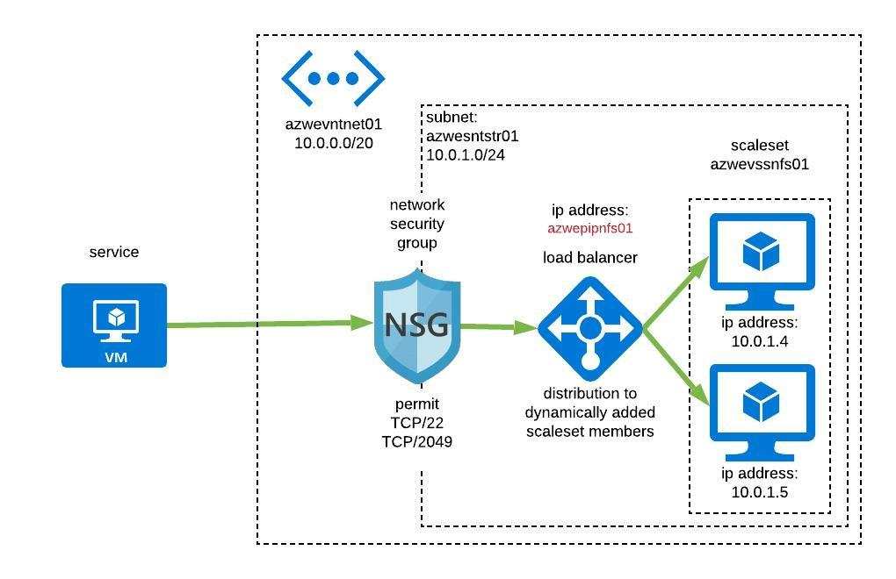

# Parameterised Ansible

Deploys single scaleset (modify inventory if changes are needed) for offering NFS services through a load balancer.  *The configuration of the NFS hosts is still outstanding*.



## Deploy

Ensure the environmental variables are set correctly!  There is no ```_id``` on the end of the secret and tenant variables!

```bash
export AZURE_SUBSCRIPTION_ID="some_subscription"
export AZURE_CLIENT_ID="some_client"
export AZURE_SECRET="some_secret"
export AZURE_TENANT="some_tenant"
```

Check prerequisites are set:

```bash
make prerequisite_check
```

Run make to deploy:

```bash
make deploy
```

Note that ```deployment``` and ```service``` tags are used to destroy the elements in order to decouple the name of the elements from their deletion.

## Cleanup

Run make to destroy:

```bash
make destroy
```

To get help, run make with no options; for example:

```bash
make
```
## Installing Applications on Scale Sets

Reference to this link can be found [here](https://docs.microsoft.com/en-us/azure/ansible/ansible-deploy-app-vmss)

## Structured ansible notes

There is a relationship between the filename in the ```group_vars``` directory and the ```group name```  in the inventory file.  
Whilst it may be possible to change this, it is better to keep this the same, unless a justification can be provided.
It seems **sensible** to maintain this relationship.

## SSH Keys

SSH public key(s) are written in the group_vars/services.yml file, which is used to populate the ```~/.ssh/authorized_keys``` file in the created user, to avoid authenticating SSH sessions with passwords.

## Structure

Structure of files is as follows:

```bash
.
├── deploy.sh
├── destroy.sh
├── inventory
│   ├── group_vars
│   │   ├── all.yml
│   │   ├── networks.yml
│   │   └── services.yml
│   └── inventory.yml
├── playbooks
│   ├── networking.yml
│   └── services.yml
└── README.md
```

## Naming standard

Rough draft, short and sweet, fixed length with reduced wastage.

* **I**nfrstructure
* **L**ocation
* **E**lement
* **F**unction
* i**N**stance

Ultimately form a name similiar to ```iilleeefffnn``` type of format, and will require review. The current prerequisite is that the most significant element should start from the left and the least end of the right providing a decending order of importance.